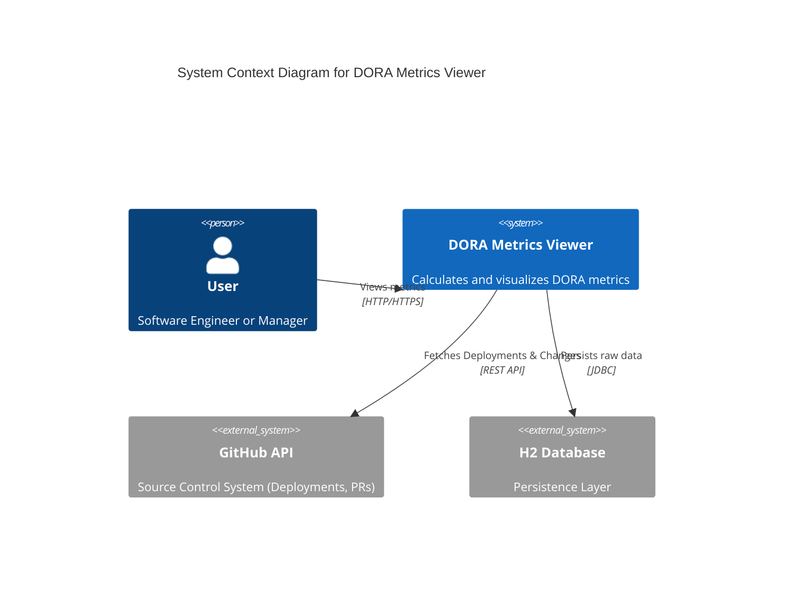
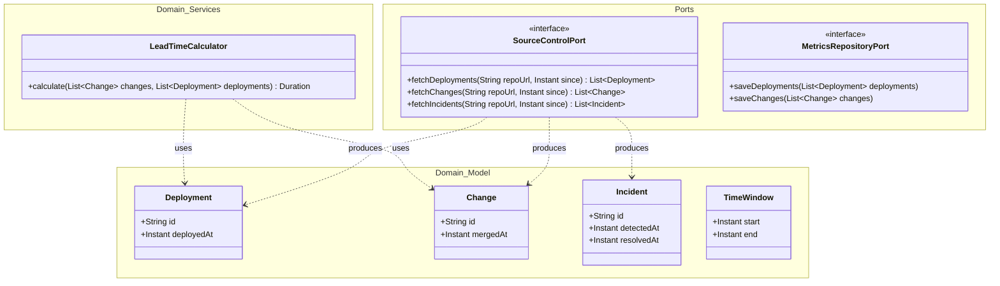
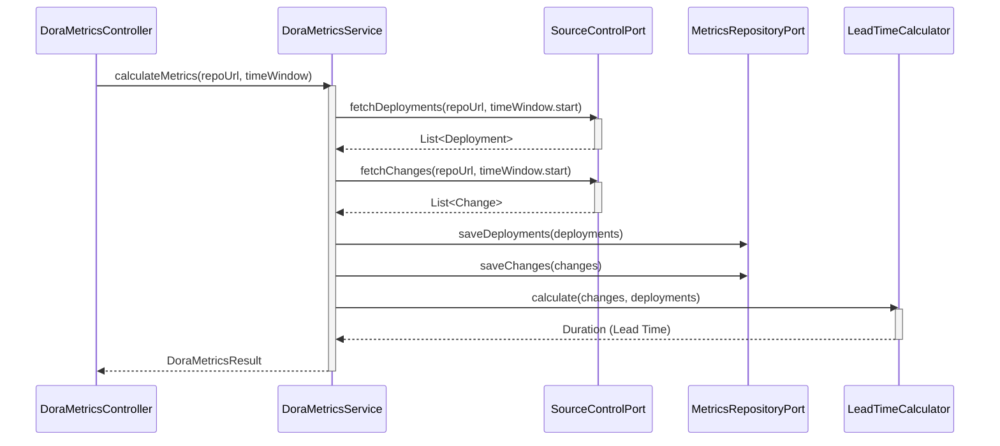

# Architecture

## High-Level Context Map (C4 Model)

```mermaid
C4Context
    title System Context Diagram for DORA Metrics Viewer

    Person(user, "User", "Software Engineer or Manager")
    System(doraSystem, "DORA Metrics Viewer", "Calculates and visualizes DORA metrics")

    System_Ext(github, "GitHub API", "Source Control System (Deployments, PRs)")
    System_Ext(h2, "H2 Database", "Persistence Layer")

    Rel(user, doraSystem, "Views metrics", "HTTP/HTTPS")
    Rel(doraSystem, github, "Fetches Deployments & Changes", "REST API")
    Rel(doraSystem, h2, "Persists raw data", "JDBC")
```

## Domain Layer Class Hierarchy

```mermaid
classDiagram
    namespace Domain_Model {
        class Deployment {
            +String id
            +Instant deployedAt
        }
        class Change {
            +String id
            +Instant mergedAt
        }
        class Incident {
            +String id
            +Instant detectedAt
            +Instant resolvedAt
        }
        class TimeWindow {
            +Instant start
            +Instant end
        }
    }

    namespace Ports {
        class SourceControlPort {
            <<interface>>
            +fetchDeployments(String repoUrl, Instant since) List~Deployment~
            +fetchChanges(String repoUrl, Instant since) List~Change~
            +fetchIncidents(String repoUrl, Instant since) List~Incident~
        }
        class MetricsRepositoryPort {
            <<interface>>
            +saveDeployments(List~Deployment~ deployments)
            +saveChanges(List~Change~ changes)
        }
    }

    namespace Domain_Services {
        class LeadTimeCalculator {
            +calculate(List~Change~ changes, List~Deployment~ deployments) Duration
        }
    }

    SourceControlPort ..> Deployment : produces
    SourceControlPort ..> Change : produces
    SourceControlPort ..> Incident : produces
    
    LeadTimeCalculator ..> Change : uses
    LeadTimeCalculator ..> Deployment : uses
```

## Core Flow: Calculate Metrics

```mermaid
sequenceDiagram
    participant Web as DoraMetricsController
    participant Service as DoraMetricsService
    participant GitHub as SourceControlPort
    participant DB as MetricsRepositoryPort
    participant Calc as LeadTimeCalculator

    Web->>Service: calculateMetrics(repoUrl, timeWindow)
    activate Service
    
    Service->>GitHub: fetchDeployments(repoUrl, timeWindow.start)
    activate GitHub
    GitHub-->>Service: List<Deployment>
    deactivate GitHub

    Service->>GitHub: fetchChanges(repoUrl, timeWindow.start)
    activate GitHub
    GitHub-->>Service: List<Change>
    deactivate GitHub

    Service->>DB: saveDeployments(deployments)
    Service->>DB: saveChanges(changes)

    Service->>Calc: calculate(changes, deployments)
    activate Calc
    Calc-->>Service: Duration (Lead Time)
    deactivate Calc

    Service-->>Web: DoraMetricsResult
    deactivate Service
```